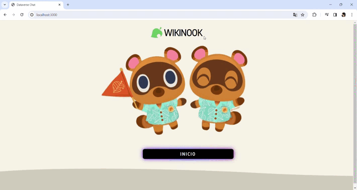
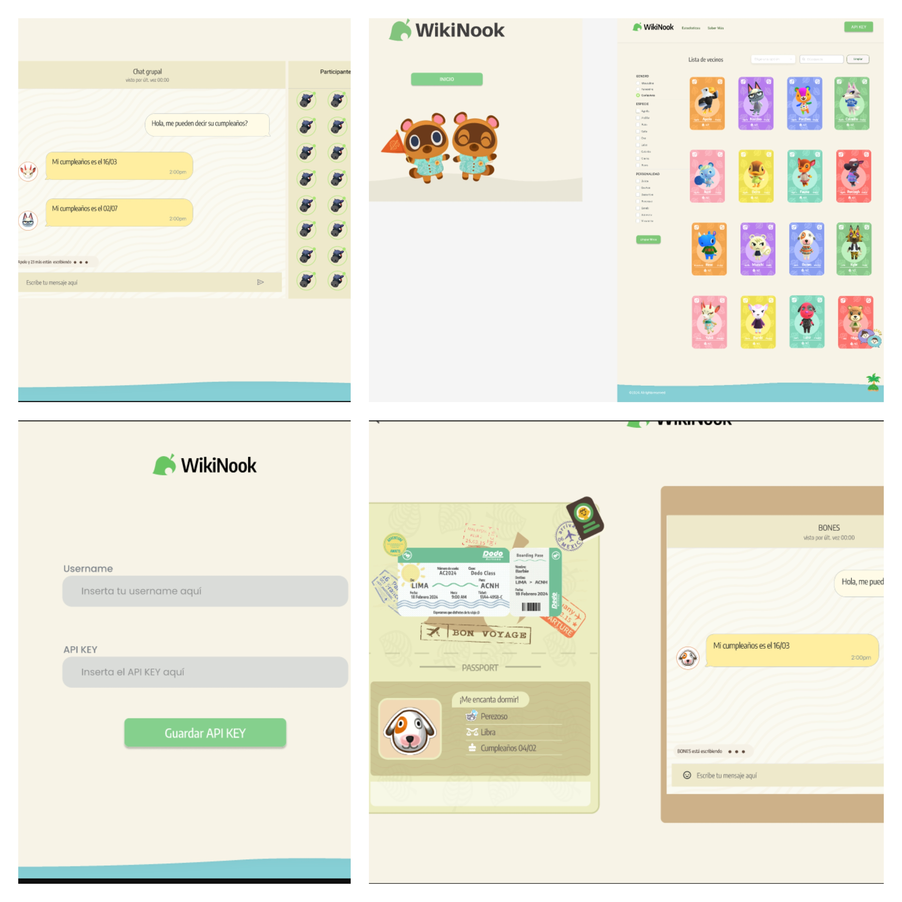

# Dataverse Chat

## Índice

* [1. Introducción](#1-Introducción)
* [2. Descripción](#2-Descripción)
* [3. Funcionalidades](#4-funcionalidades)
* [4. Historia de usuario](#5-Historia-de-usuario)
* [5. Tecnologías utilizadas](#5-Tecnologías-utilizadas)
* [6. Diseño y Desarrollo del Prototipo](#7-Diseño-y-Desarrollo-del-Prototipo)
* [7. Testeos de usabilidad](#6-Testeos-de-usabilidad)

***

## 1. Introducción

¡Bienvenido a WikiNook 2.0 🏡!
Este proyecto es una aplicación web dedicada a los amantes del videojuego Animal Crossing, específicamente diseñada para explorar y conocer más sobre los adorables vecinos del juego. Con un diseño inspirado en la estética de Animal Crossing, WikiNook ofrece una experiencia interactiva para descubrir información detallada sobre cada vecino, puedes chatear con ellos, clasificarlos según su especie, personalidad, género, y además buscarlos por su nombre.

## 2. Descripción

WikiNook tiene como objetivo proporcionar a los jugadores de Animal Crossing una plataforma intuitiva y atractiva para explorar información detallada sobre sus vecinos favoritos. Desde clasificar a los vecinos por personalidad y especie hasta la posibilidad de buscarlos por nombre, WikiNook es la guía perfecta para conocer a fondo la comunidad animal de tu isla.

Dataverse-chat es un la continuación del proyecto dataverse, es una implementación con IA, de manera que podrás interactuar a través de un chat individual y grupal con tus personajes favoritos. Además siempre podrás encontrar información adicional sobre ellos al dar clic sobre la tarjeta del vecino.

## 3. Funcionalidades

* Exploración por Filtros: Filtra a los vecinos por personalidad, especie y género, esta sección cuenta con un botón de limpiado de dichos filtros y devuelve los datos a su estado inicial.
* Orden Alfabético: Explora la lista de vecinos de manera ascendente o descendente por orden alfabético a través de un selector.
* Barra de Búsqueda: Encuentra rápidamente a tu vecino favorito por su nombre, cuenta con un botón que limpia la búsqueda realizada.
* Estadísticas: Accede a las distintas estadísticas por las que se clasifican los vecinos existentes en la plataforma, tales como su genero, personalidad y especie.
* Botón del Api: Este botón nos lleva hacia donde se localiza el Api permitiendo que pongamos el nombre del usuario y la llave que nos va a pemitir el acceso al chat con los participantes.
* Botón usuario: Este botón nos permite acceder donde se localiza el Api, después de ser guardada y nos da la opción de eliminar la llave.
* Chat individual: El acceso se da al dar clic sobre cualquier tarjeta de los personajes, este nos manda a un chat individual con el vecino que se selecciono, si no hay llave guardada no redirecciona a la vista del Api.
* Chat grupal: Al dar clic en el icono nos lleva a un chat en el que podrás platicar con todos los personajes al mismo tiempo.

## 4. Historia de usuario

Se realizo un documento con las funcionalidades del proyecto, pedidas desde el punto de vista de un usuario, simulando una situación en la que podría ser usada. Aquí mostramos el enlace del documento realizada para el usuario que nos permite conocer los pasos en los que se desarrollo el proyecto.

[Enlace del documento](https://docs.google.com/document/d/1KCDX0VXriCT2YyL0LWDCvNA1Gj6dbtcZ49BWl-eCmLg/edit?usp=sharing)

## 5. Tecnologías utilizadas

El desarrollo de WikiNook se benefició de un conjunto diverso de tecnologías y herramientas que permitieron una implementación robusta y una experiencia de usuario enriquecedora.

### HTML
Se utilizo para almacenar todas las estructuras HTML realizas desde JS, contenido de la aplicación web.

### CSS
Se empleó CSS con la técnica de Flexbox para crear un diseño adaptable (responsive) y atractivo que se alinea con la estética de Animal Crossing.

### JavaScript

## Uso de JavaScript en WikiNook

JavaScript juega un papel fundamental en WikiNook, no solo en la manipulación dinámica del DOM, sino también en varias funcionalidades clave que van desde la gestión de filtros hasta la interactividad con tarjetas de vecinos y la lógica de búsqueda, que mejoran la experiencia del usuario abarcando diversas interacciones y dinámicas presentes en la aplicación.

## Características Destacadas:

1. **Arquitectura de SPA y Enrutamiento:**
   - WikiNook ahora opera como una Single Page Application (SPA) gracias a un router construido completamente en JavaScript vanilla. Este enrutador permite la transición fluida entre diferentes vistas, mejorando la navegación del usuario.

2. **Manipulación Dinámica del LocalStorage:**
   - Utilizamos JavaScript para acceder y manipular de manera dinámica el LocalStorage del navegador. Esta capacidad permite un almacenamiento eficiente de datos locales, mejorando la interactividad y proporcionando una experiencia personalizada al usuario.

3. **Gestión de Pathname:**
   - La habilidad de acceder al pathname de la página mediante JavaScript proporciona información en tiempo real sobre la ubicación del usuario en la aplicación. Esto contribuye a una navegación más informada y contextual.

4. **Consumo Eficiente de OpenAI API:**
   - En colaboración con Axios, JavaScript se utilizó para consumir de manera inteligente la API de OpenAI mediante el manejo de promesas. Esta integración permite acceder a la funcionalidad de OpenAI directamente desde WikiNook.

5. **Estructura Basada en Componentes:**
   - Implementamos una estructura basada en el uso de componentes. Esta metodología facilita el mantenimiento del código, mejora la modularidad y permite un desarrollo más escalable.

### Testing
Se utilizó Jest para realizar pruebas unitarias con el uso de mock, asegurando la integridad y funcionalidad correcta de las distintas partes del código. Las pruebas unitarias contribuyeron a mantener la calidad del código y facilitaron futuras actualizaciones y expansiones del proyecto.

## 6. Diseño y Desarrollo del Prototipo
El proceso de diseño y desarrollo del prototipo de WikiNook fue llevado a cabo con atención meticulosa, centrándonos en la experiencia del usuario y la estética inspirada en Animal Crossing. Utilizamos la plataforma de diseño colaborativo Figma para crear prototipos de media y alta fidelidad que sirvieron como guía visual y funcional antes de la implementación final.

### Prototipo fidelidad alta
Se realizo un prototipo de alta fidelidad, que es la culminación del proyecto, en cuanto a interacción con el usuario, así como los acabados que debe tener la página y las tarjetas mostradas.

### Implementación
* Transición a Desarrollo.
* Adaptación a Tecnologías Seleccionadas.  
¡Tú también puedes echarle un vistazo a nuestro prototipo! clic aquí [Link al prototipo](https://www.figma.com/proto/UEVTY1rby4R9BMOrv4sp8J/Wikinook%2FDataverse?type=design&node-id=1-3506&t=9o74RyDyWvTNnIjl-0&scaling=scale-down&page-id=0%3A1&starting-point-node-id=1%3A3506)

## 7. Testeos de usabilidad

Se realizo una prueba de usabilidad con usuarios elegidos al azar para ayudarnos a generar información que nos fue de utilidad para el mejoramiento dinámico y visual de la página.

[Enlace del documento](https://docs.google.com/document/d/1kkh7_OWHChwCiappe9eLaYWBUV-tjlUVkmnMpctWin4/edit#heading=h.icq4iwform4o)
